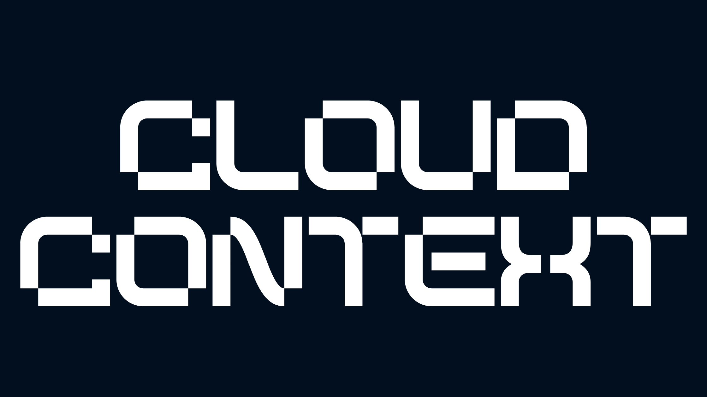

<a href="https://cloudcontext.cc/">
  <h1 align="center">Cloud Context Waitlist</h1>
</a>
<p align="center">

</p>
<!-- 
</br>
[![GitHub Actions Workflow Status][check-workflow-badge]][check-workflow-badge-link] [![GitHub License][github-license-badge]][github-license-badge-link] [![GitHub contributors][github-contributors-badge]][github-contributors-badge-link] [![Discord][discord-badge]][discord-badge-link] [![Blazity][made-by-blazity-badge]][made-by-blazity-badge-link]
-->
<p align="center">
  <a href="https://discord.gg/dHyxhTEzUb"><strong>Reddit</strong></a> ·
  <a href="https://discord.gg/dHyxhTEzUb"><strong>Discord</strong></a> ·
  <a href="https://discord.gg/dHyxhTEzUb"><strong>X</strong></a> ·
  <a href="https://discord.gg/dHyxhTEzUb"><strong>Instagram</strong></a> ·
  <a href="https://discord.gg/dHyxhTEzUb"><strong>Github</strong></a>
</p>

Don't forget to leave a ⭐ on [GitHub](https://github.com/mathewlewallen) and join our [waitlist](https://cloudcontext.cc)!

Check it out [here](https://cloudcontext.cc)

---

## Table of Contents

- [Introduction](#nextjs-enterprise-boilerplate)
- [Features](#features)
- [Getting Started](#-getting-started)
- [Scripts](#-scripts-overview)
- [Coupling Graph](#-coupling-graph)
- [Testing](#-testing)
  - [Running Tests](#running-tests)
  - [Acceptance & Smoe Tests](#acceptance--smoke-tests)
- [Styling & Design System](#styling--design-system)
  - [CVA - A New Approach to Variants](#cva---a-new-approach-to-variants)
- [State Management](#-state-management)
- [Environment Variables handling](#-environment-variables-handling)
- [Specifics](#specifics)
  - [Online Demo](#online-demo)
  - [Tech Stack & Features](#tech-stack--features)
  - [Roadmap](#roadmap)
  - [Emails & Reports](#emails--reports)
  - [Installation & Docker](#installation--docker)
- [Contribution](#-contribution)
- [Support](#support)
- [License](#-license)
- [Contributors](#contributors)

---

## Introduction

Welcome to the merged **Cloud Context Waitlist** repository! This project creates a comprehensive waitlist solution for Cloud Context with a fully featured CRM built on Next.js. The unified template is optimized for performance and includes advanced features like internationalization, state management, testing, a robust design system with Tailwind CSS and CVA, and seamless integrations for emails, AI, and document processing.


### Integrated features

With this template you will get all the awesomeness you need:

- 🏎️ **[Next.js 15+ w/ App Router](https://nextjs.org/)** - Fast, modern React framework with performance optimizations
- 💅 **[Tailwind CSS & CVA](https://tailwindcss.com/)** - Utility-first styling and a flexible design system
- ✨ **[ESlint](https://eslint.org/)** and **[Prettier](https://prettier.io/)** - Enforced code quality and consistency
- 🛠️ **[Extremely strict TypeScript](https://www.typescriptlang.org/)** - With [`ts-reset`](https://github.com/total-typescript/ts-reset) library for ultimate type safety
- 🚀 **[GitHub Actions](https://github.com/features/actions)** - Pre-configured actions for smooth workflows, including Bundle Size and performance stats
- 💯 **Perfect Lighthouse score** - Because performance matters
- **[State Management](https://github.com/pmndrs/zustand)** – Powered by Zustands bear necessity library
- **[Bundle Analysis](https://www.npmjs.com/package/@next/bundle-analyzer)** - Keep an eye on your bundle size
- **[Jest](https://jestjs.io/)** and **[React Testing Library](https://testing-library.com/react)** - For rock-solid unit and integration tests
- **[Playwright](https://playwright.dev/)** - Write end-to-end tests like a pro
- **[Storybook](https://storybook.js.org/)** - Create, test, and showcase your components
- **Smoke Testing** and **Acceptance Tests** - For confidence in your deployments
- **[Conventional commits git hook](https://www.conventionalcommits.org/)** - Keep your commit history neat and tidy
- **[Observability](https://opentelemetry.io/)** - OpenTelemetry integration for seamless monitoring
- **[Absolute imports](https://nextjs.org/docs/advanced-features/module-path-aliases)** - No more spaghetti imports
- **[Health checks](https://kubernetes.io/docs/tasks/configure-pod-container/configure-liveness-readiness-startup-probes/)** - Kubernetes-compatible for robust deployments
- **[Radix UI](https://www.radix-ui.com/)** - Headless UI components for endless customization
- **[CVA](http://cva.style/)** - Create a consistent, reusable, and atomic design system
- **[Renovate BOT](https://www.whitesourcesoftware.com/free-developer-tools/renovate)** - Auto-updating dependencies, so you can focus on coding
- **[Patch-package](https://www.npmjs.com/package/patch-package)** - Fix external dependencies without losing your mind
- **Components coupling and cohesion graph** - A tool for managing component relationships
- **Internationalization** – Configured with next-intl for multiple locales
- **TypeScript** – Strict type safety using ts-reset
- **Document Processing** – Rossum integration for invoice data extraction
- **Emails** – Automated notifications via Resend and react.email
- **CRM Functionality** – A full-featured CRM with authentication, data fetching, and charting using Tremor
- **Waitlist Functionality** – Capture early access sign-ups for Cloud Context
- **[Semantic Release](https://github.com/semantic-release/semantic-release)** - for automatic changelog
- **[T3 Env](https://env.t3.gg/)** - Manage your environment variables with ease
- **[Auth.js](https://authjs.dev/)** – Handle user authentication with ease with providers like Google, Twitter, GitHub, etc.
- **[Prisma](https://www.prisma.io/)** – Typescript-first ORM for Node.js
- **[React Email](https://react.email/)** – Versatile email framework for efficient and flexible email development
- **[Vercel](https://vercel.com/)** – Easily preview & deploy changes with git
- **[Mongo DB Atlas](https://mongodb.com/)** – A database platform for seamless, scalable data management
- **[Resend](https://resend.com/)** – A powerful email framework for streamlined email development together with [react.email](https://react.email)
- **[SWR](https://swr.vercel.app/)** – React Hooks library for remote data fetching
- **[Axios](https://axios-http.com/)** – Promise based HTTP client for the browser and node.js
- **[Tanstack/react-query](https://react-query.tanstack.com/)** - for server/client side data fetching
- **[Shadcn/ui](https://ui.shadcn.com/)** – Re-usable components built using Radix UI and Tailwind CSS
- **[Tremor](https://www.tremor.so/)** – A platform for creating charts
- **[OpenAI API](https://openai.com/blog/openai-api)** - for automated email notifications generated by AI
- **[Rossum](https://rossum.ai/)** - for invoice data parsing with AI

## 🎯 Getting Started

### Prerequisites

- [Node.js](https://nodejs.org/) (v14 or later)
- [pnpm](https://pnpm.io/) or your favorite package manager

### Setup

1. **Fork & Clone the Repository**
  ```bash
  # Don't forget to fork the repo
  git clone https://github.com/<your_username>/cloud-context-waitlist.git
  # and also ⭐ it while you're at it.
  cd cloud-context-waitlist
  ```

2. **Install the dependencies**
  ```bash
  pnpm install --frozen-lockfile
  ```

3. **Environment Variables**
  ```bash
  cp .env.example .env
  cp .env.local.example .env.local
  ```

4. **Init the DB**
  ```bash
  pnpm prisma generate
  pnpm prisma db push
  pnpm prisma db seed
  ```

5. **Run the development server**
  ```bash
  pnpm run dev
  ```

6. **Open Your Browser**

  Navigate to [http://localhost:3000](http://localhost:3000).

## 📃 Scripts

The following scripts are available in the `package.json`:

- `dev`: Starts the development server with colorized output
- `build`: Builds the app for production
- `start`: Starts the production server
- `lint`: Lints the code using ESLint
- `lint:fix`: Automatically fixes linting errors
- `format`: Checks the code for proper formatting
- `format:fix`: Automatically fixes formatting issues
- `analyze`: Runs bundle analysis
- `storybook`: Starts the Storybook server
- `test-storybook`: Tests the Storybook setup
- `build-storybook`: Builds the Storybook for deployment
- `test`: Runs unit and integration tests
- `e2e:headless`: Runs end-to-end tests in headless mode
- `e2e:ui`: Runs end-to-end tests with UI
- `postinstall`: Applies patches to external dependencies
- `coupling-graph`: Generates a coupling graph of components

## 🔗 Coupling Graph

Generate a visual representation of your component relationships using [Madge](https://github.com/pahen/madge):

```bash
pnpm run coupling-graph
```

Open the generated `graph.svg` file with any SVG viewer.


## 🧪 Testing

### Running Tests

- **Unit and integration tests**: 
  ```bash
  pnpm run test
  ```
- **End-to-end tests**:
  - Headless:
    ```bash
    pnpm run e2e:headless
    ```
  - UI:
    ```bash
    pnpm run e2e:ui
    ```

### Acceptance & Smoke Tests
Use Storybook’s [play function](https://storybook.js.org/docs/react/writing-stories/play-function#writing-stories-with-the-play-function) for acceptance testing & run smoke tests with:
    
  ```bash
  pnpm run test-storybook
  ```

[Example Storybook play function:](https://storybook.js.org/docs/react/writing-stories/play-function#working-with-the-canvas)
```ts
export const FilledForm: Story = {
  play: async ({ canvasElement }) => {
    const canvas = within(canvasElement)
    const emailInput = canvas.getByLabelText("email", { selector: "input" })
    await userEvent.type(emailInput, "example-email@email.com", { delay: 100 })
    const submitButton = canvas.getByRole("button")
    await userEvent.click(submitButton)
  },
}
```

## 🎨 Styling & Design System

This project uses Tailwind CSS for styling and CVA (Class Variance Authority) for creating variants in a type-safe manner.

### CVA – A New Approach to Variants

CVA simplifies creating reusable, consistent component variants without the overhead of complex CSS-in-JS solutions. Check out [CVA](https://www.youtube.com/watch?v=T-Zv73yZ_QI&ab_channel=Vercel) for more details.

## 💾 State Management

We use [Zustand](https://github.com/pmndrs/zustand) for state management, offering a lightweight, fast, and scalable solution. You can also consider alternatives like Jotai or Recoil depending on your needs.

Example usage:
```ts
// store.ts
import { create } from 'zustand'

type Store = {
  count: number
  inc: () => void
}

const useStore = create<Store>()((set) => ({
  count: 1,
  inc: () => set((state) => ({ count: state.count + 1 })),
}))

function Counter() {
  const { count, inc } = useStore()
  return (
    <div>
      <span>{count}</span>
      <button onClick={inc}>one up</button>
    </div>
  )
}
```

## 💻 Environment Variables handling

We use [T3 Env](https://env.t3.gg/) for validating and transforming environment variables at build time.

Example configuration `env.mjs`:
```ts
import { z } from 'zod'
import { createEnv } from 't3-env' // or your chosen env library

export const env = createEnv({
  server: {
    SECRET_KEY: z.string(),
    EMAIL_API_KEY: z.string(),
    DATABASE_URL: z.string().url(),
  },
  client: {
    API_URL: z.string().url(),
  },
  runtimeEnv: {
    SECRET_KEY: process.env.SECRET_KEY,
    EMAIL_API_KEY: process.env.EMAIL_API_KEY,
    DATABASE_URL: process.env.DATABASE_URL,
    API_URL: process.env.NEXT_PUBLIC_API_URL,
  },
})
```

If the required environment variables are not set, you'll get an error message:

```sh
  ❌ Invalid environment variables: { SECRET_KEY: [ 'Required' ] }
```

## Specifics

**Waitlist Form & API**: A simple form component collects emails and posts them to an API route `/api/waitlist` that stores entries using `Prisma`.

**Email Integration**: When a user signs up, a welcome email is sent using [Resend](https://resend.com).

**Document Processing with Rossum**: A dedicated Rossum folder contains configuration (e.g., settings.json) for processing document data such as invoices and receipts.

**Emails & Reports**:
    Using `Resend` combined with React Email for transactional emails. Visualizations are created with `Tremor` charts.

## 🤝 Contribution

Contributions are always welcome! To contribute, please follow these steps:

1. Fork the [repository](https://github.com/mathewlewallen/cloud-context-waitlist).
2. Create a new branch with a descriptive name.
3. Make your changes, and commit them using the [Conventional Commits](https://www.conventionalcommits.org/) format.
4. Push your changes to the forked repository.
5. Create a pull request, and we'll review your changes.

## Support

For help or to share your thoughts, join our [Discord community](https://discord.gg/5QzMemJn).

## 📜 License

This project is licensed under the MIT License. For more information, see the [LICENSE](./LICENSE) file.


<!-- Badges and links -->
<!-- 
[check-workflow-badge]: https://img.shields.io/github/actions/workflow/status/blazity/cloud-context-waitlist/check.yml?label=check
[github-license-badge]: https://img.shields.io/github/license/blazity/cloud-context-waitlist?link=https%3A%2F%2Fgithub.com%2FBlazity%2Fcloud-context-waitlist%2Fblob%2Fmain%2FLICENSE
[github-contributors-badge]: https://img.shields.io/github/contributors/blazity/cloud-context-waitlist?link=https%3A%2F%2Fgithub.com%2FBlazity%2Fcloud-context-waitlist%2Fgraphs%2Fcontributors
[discord-badge]: https://img.shields.io/discord/1111676875782234175?color=7b8dcd&link=https%3A%2F%2Fblazity.com%2Fdiscord
[made-by-blazity-badge]: https://img.shields.io/badge/made_by-Blazity-blue?color=FF782B&link=https://blazity.com/

[check-workflow-badge-link]: https://github.com/Blazity/cloud-context-waitlist/actions/workflows/check.yml
[github-license-badge-link]: https://github.com/Blazity/cloud-context-waitlist/blob/main/LICENSE
[github-contributors-badge-link]: https://github.com/Blazity/cloud-context-waitlist/graphs/contributors
[discord-badge-link]: https://blazity.com/discord
[made-by-blazity-badge-link]: https://blazity.com/?utm_source=nextenterprise&utm_medium=github
-->
